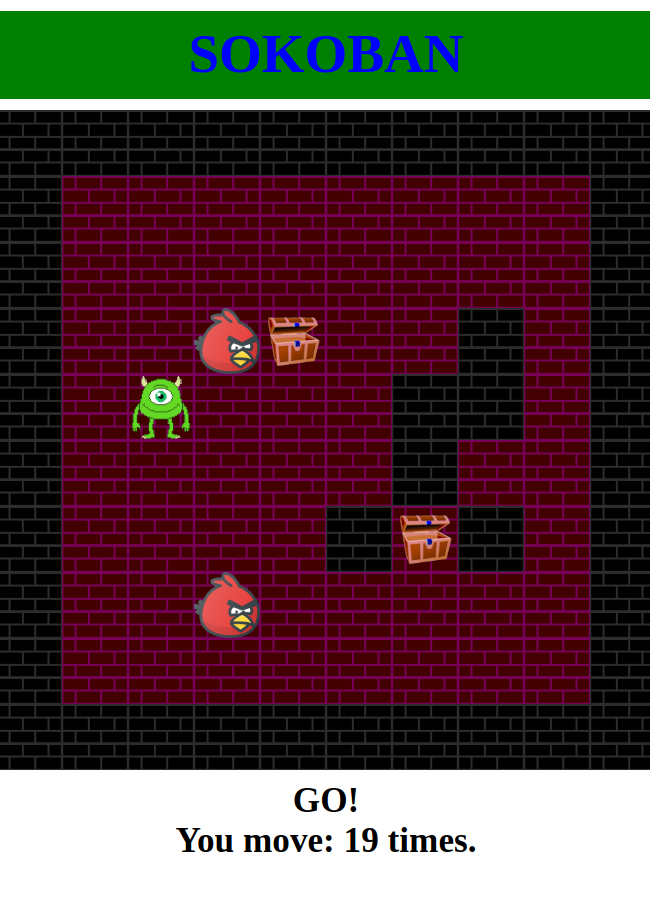
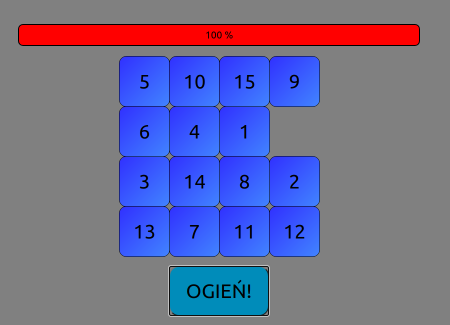
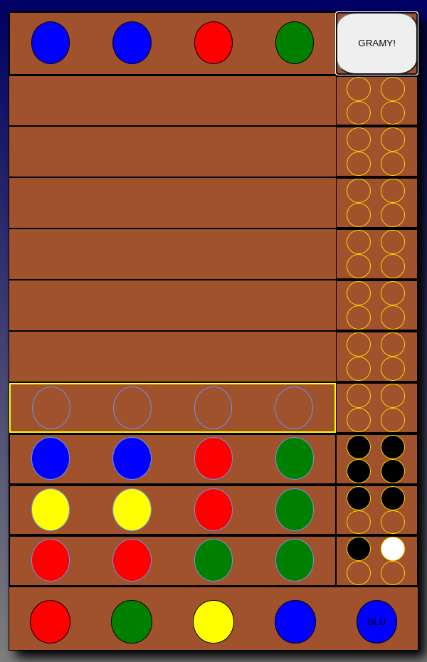

# miniGame
In this repository you can run some mini games like: "Pong", "Memory", "Sokoban"...

To run for example "Sokoban" open "sokoban" folder dictionary, and open "index.html" file in browser.

